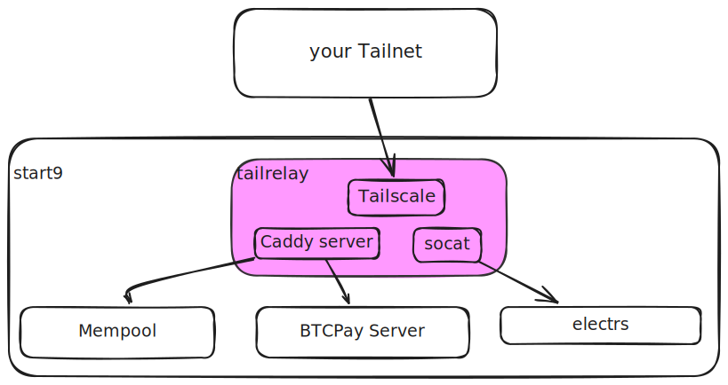

# tailrelay

A Docker container that exposes local services to your Tailscale network. Combines **Tailscale VPN**, **Caddy reverse proxy**, **socat TCP relays**, and a **Web UI** for browser-based management.

[](https://hub.docker.com/r/sudocarlos/tailrelay)
[](https://github.com/sudocarlos/tailscale-socaddy-proxy/releases)
[](https://github.com/sudocarlos/tailscale-socaddy-proxy/blob/main/LICENSE)

## Features

- **Web UI** - Browser-based management on port 8021
- **Automatic TLS** - Tailscale HTTPS certificates via Caddy
- **HTTP/HTTPS Proxies** - Configure reverse proxies through the UI
- **TCP Relays** - Forward non-HTTP protocols with socat
- **Backup & Restore** - Save and restore configurations
- **Dual Authentication** - Token or Tailscale network authentication
- **Multi-Platform** - Docker images for amd64 and arm64



## Table of Contents

- [Features](#features)
- [Why tailrelay?](#why-tailrelay)
- [Technology Stack](#technology-stack)
- [Quick Start](#quick-start)
- [Web UI](#web-ui)
- [Getting Started](#getting-started)
  - [Prerequisites](#prerequisites)
  - [Tailscale Setup](#tailscale-setup)
  - [Start9 Deployment](#start9-deployment)
- [Development](#development)
  - [Local WebUI Development](#local-webui-development)
  - [Building](#building)
  - [Testing](#testing)
- [Troubleshooting](#troubleshooting)
- [Contributing](#contributing)


## Why tailrelay?

tailrelay provides secure remote access to self-hosted services:

- **Secure Access**: Tailscale's VPN eliminates port forwarding requirements
- **Easy Configuration**: Web UI handles setup without manual config files
- **Automatic TLS**: Caddy obtains and renews certificates via Tailscale HTTPS
- **Protocol Support**: HTTP/HTTPS proxies and TCP relays for any service
- **Backup & Restore**: Save and restore configurations

Useful for accessing Start9 services like BTCPayServer, LND, electrs, and Mempool without Tor.


## Technology Stack

| Component | Purpose | Documentation |
|-----------|---------|---------------|
| **Tailscale** | VPN, MagicDNS, device authentication | [Tailscale docs](https://tailscale.com/kb) |
| **Caddy** | HTTP/2 reverse proxy, automatic HTTPS | [Caddy docs](https://caddyserver.com/docs) |
| **socat** | TCP relay for non-HTTP services | [socat manual](https://linux.die.net/man/1/socat) |
| **Web UI** | Browser-based management (Go, HTML/CSS/JS) | See [Web UI](#web-ui) section |


## Quick Start

```bash
# Pull the image
docker pull sudocarlos/tailrelay:latest

# Run the container
docker run -d --name tailrelay \
  -v /path/to/data:/var/lib/tailscale \
  -e TS_HOSTNAME=myserver \
  -p 8021:8021 \
  --net bridge \
  sudocarlos/tailrelay:latest

# Get the Web UI token
docker exec tailrelay cat /var/lib/tailscale/.webui_token

# Access the Web UI
open http://localhost:8021
```


## Web UI

The Web UI provides browser-based management on port 8021.

### Features

- **Dashboard** - Real-time Tailscale connection status and system health
- **Tailscale Management** - Connect/disconnect and view network peers
- **Caddy Proxy Management** - Add, edit, delete, and toggle HTTP/HTTPS reverse proxies
- **Socat Relay Management** - Start, stop, and restart TCP relay processes
- **Backup & Restore** - Create and restore compressed tar.gz backups

### Authentication

The Web UI uses two authentication methods:

1. **Token Authentication**: A random token is generated on first startup at `/var/lib/tailscale/.webui_token`
   ```bash
   # Docker
   docker exec tailrelay cat /var/lib/tailscale/.webui_token
   
   # Podman
   sudo podman exec start9.tailscale cat /var/lib/tailscale/.webui_token
   ```

2. **Tailscale Network Authentication**: Devices on your Tailscale network are automatically authenticated

### Access

The Web UI runs on port 8021:
```bash
# Via Tailscale hostname (if HTTPS is enabled)
https://your-hostname.your-tailnet.ts.net:8021

# Or via local IP
http://localhost:8021
```


## Getting Started

### Prerequisites

1. A Tailscale account with an active Tailnet ([tailscale.com](https://tailscale.com))
2. [HTTPS certificates enabled](https://tailscale.com/kb/1153/enabling-https) in Tailscale Admin console
3. Docker or Podman installed

### Tailscale Setup

1. Log into Tailscale Admin console and click [DNS](https://login.tailscale.com/admin/dns)
2. Verify or set your [Tailnet name](https://tailscale.com/kb/1217/tailnet-name)
3. Scroll down and enable HTTPS under HTTPS Certificates

### Start9 Deployment

### Start9 Deployment

1. SSH into your Start9 server:
   ```bash
   ssh start9@SERVER-HOSTNAME
   ```

2. Create a directory for persistent data:
   ```bash
   mkdir -p /home/start9/tailscale
   ```

3. Run the container:
   ```bash
   sudo podman run --name start9.tailscale \
     -v /home/start9/tailscale/:/var/lib/tailscale \
     -e TS_HOSTNAME=start9 \
     -p 8021:8021 \
     --net start9 \
     docker.io/sudocarlos/tailrelay:latest
   ```

4. Get the Web UI token:
   ```bash
   sudo podman exec start9.tailscale cat /var/lib/tailscale/.webui_token
   ```

5. Access the Web UI at `http://localhost:8021`

**Environment Variables:**
- `TS_HOSTNAME` - Tailnet machine name
- `RELAY_LIST` - (Optional, deprecated) Comma-separated relay definitions. Use Web UI instead.
- `MAX_LOG_BODY_SIZE` - Max bytes for Caddy API request/response body logging (0 = full body)

**Volume Mounts:**
- `/var/lib/tailscale` - Tailscale state, Web UI configs, backups

**Network:**
- `--net start9` - Required to access Start9 services

See [Tailscale Docker docs](https://tailscale.com/kb/1282/docker) for more options.


## Development

### Local WebUI Development

For rapid iteration without rebuilding the full Docker image:

#### 1. Build the WebUI Binary

```bash
make dev-build
```

This compiles `./data/tailrelay-webui` with build metadata (version, commit, date).

**Manual build:**
```bash
cd webui
CGO_ENABLED=0 GOOS=linux go build -a -installsuffix cgo \
  -ldflags="-w -s" \
  -o ../data/tailrelay-webui ./cmd/webui
```

#### 2. Development Options

**Option A: Mount Binary (Recommended)**

Mount the local binary for instant updates:

```yaml
# compose-test.yml
services:
  tailrelay:
    volumes:
      - ./data/tailrelay-webui:/usr/bin/tailrelay-webui:ro
      - ./tailscale/:/var/lib/tailscale
```

Then restart:
```bash
docker compose -f compose-test.yml restart tailrelay
```

**Iteration workflow:**
1. Edit code in `webui/`
2. Run `make dev-build`
3. Restart container
4. Test changes

**Option B: Build Development Image**

```bash
make dev-docker-build
```

This builds a Docker image using the local binary.

### Building

```bash
# Development build with local binary
make dev-build
make dev-docker-build

# Production build (multi-stage)
docker buildx build -t sudocarlos/tailrelay:latest .

# Show available targets
make help
```

### Testing

```bash
# Python test suite
python docker-compose-test.py

# Bash test suite
./docker-compose-test.sh
```

**Setup:**
1. Copy `.env.example` to `.env`
2. Edit variables (`TAILRELAY_HOST`, `TAILNET_DOMAIN`)
3. Run tests

### Build Metadata

The `dev-build` target injects build information:

```go
var (
  version = "dev"      // Git describe output
  commit  = "none"     // Short commit hash
  date    = "unknown"  // Build timestamp (UTC)
  branch  = "unknown"  // Git branch
  builtBy = "local"    // System username
)
```

Access these in `webui/cmd/webui/main.go`.

## Troubleshooting

### Web UI Not Accessible

Check container status:
```bash
docker ps | grep tailrelay
```

Verify port mapping:
```bash
docker port tailrelay
```

Check logs:
```bash
docker logs tailrelay | grep -i webui
```

Verify listening port:
```bash
docker exec tailrelay netstat -tulnp | grep 8021
```

### Cannot Log In

Retrieve token:
```bash
docker exec tailrelay cat /var/lib/tailscale/.webui_token
```

Ensure you're accessing from Tailscale network or clear browser cache.

### Caddy Proxy Issues

Validate configuration:
```bash
docker exec tailrelay caddy validate --config /etc/caddy/Caddyfile
```

Check Caddy logs:
```bash
docker logs tailrelay | grep -i caddy
```

### Socat Relay Issues

Check relay status:
```bash
docker exec tailrelay ps aux | grep socat
```

Verify listening ports:
```bash
docker exec tailrelay netstat -tulnp | grep socat
```

Test target connectivity:
```bash
docker exec tailrelay nc -zv target-host target-port
```


## Contributing

Contributions welcome:

- **Issues**: [GitHub Issues](https://github.com/sudocarlos/tailscale-socaddy-proxy/issues)
- **Pull Requests**: [GitHub PRs](https://github.com/sudocarlos/tailscale-socaddy-proxy/pulls)
- **Documentation**: Help improve docs or add examples

### Development Setup

```bash
# Clone repository
git clone https://github.com/sudocarlos/tailscale-socaddy-proxy.git
cd tailscale-socaddy-proxy

# Build locally
docker build -t tailrelay:dev .

# Run tests
docker-compose -f compose-test.yml up
```

See [Development](#development) section for WebUI development workflow.


## Release Notes

- [v0.2.1](docs/release-notes/RELEASE_NOTES_v0.2.1.md) - Caddy API integration
- [v0.2.0](docs/release-notes/RELEASE_NOTES_v0.2.0.md) - Web UI release


## License

Open source project. See repository for license details.


## Acknowledgments

- [Tailscale](https://tailscale.com) - VPN platform
- [Caddy](https://caddyserver.com) - Reverse proxy
- [Start9](https://start9.com) - Inspiration for this project
- Original project by [@hollie](https://github.com/hollie/tailscale-caddy-proxy)